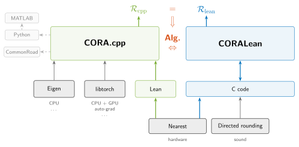

# CORA.cpp

Parts of [CORA](https://cora.in.tum.de), the toolbox for set-based computing, in C++ and Python.
Runs on CPU and GPU, batches automatically, is differentiable. Names follow MATLAB CORA:
`contSet/zonotope/mtimes.cpp` is `@zonotope/mtimes.m`.

C++:

```cpp
#include "contDynamics/linearSys/linearSys.h"
#include "global/plot/plot.h"
#include "specification/specification.h"
using namespace cora;

Tensor A({{-0.1, 1}, {-1, -0.1}});                                     // x' = A x
Zonotope X0(Tensor({1, 0}), 0.1 * Tensor::eye(2));                     // center, generators
Reach R = LinearSys(A).reach(X0, /*timeStep=*/0.1, /*tFinal=*/5.0);
Specification spec = Specification::unsafeSet(Tensor({1, 0}), -0.75);  // stay out of x1 <= -0.75
bool safe = spec.check(R.timeInt);
plot(R, {0, 1});                                                       // dimensions to show
figure().save("reach.svg");                                            // C++ writes SVG
```

Python:

```python
from cora import Tensor, Zonotope, LinearSys, Specification, eye, plot

A = Tensor([[-0.1, 1], [-1, -0.1]])                                    # x' = A x
X0 = Zonotope(Tensor([1, 0]), 0.1 * eye(2))                            # center, generators
R = LinearSys(A).reach(X0, timeStep=0.1, tFinal=5.0)
spec = Specification.unsafeSet(Tensor([1, 0]), -0.75)                  # stay out of x1 <= -0.75
safe = spec.check(R.timeInt)
plot(R)                                                                # dims default to (0, 1)
```

## Install

Needs a C++20 compiler and CMake 3.25 or newer, on Linux, macOS or Windows:

```bash
cmake --workflow --preset core        # or: see table below for python, torch, cuda
```

The same in separate steps:

```bash
cmake --preset core
cmake --build --preset core
ctest --preset core
```

| preset | installs |
| --- | --- |
| `core` | eigen |
| `torch` | eigen + torch |
| `torch-cuda` | eigen + torch + cuda |
| `python` | eigen + python + numpy |
| `python-torch` | eigen + python + numpy + torch |
| `python-torch-cuda` | eigen + python + numpy + torch + cuda |

- Eigen is downloaded if it is not installed.
- The Python presets create `.venv` in the project folder and install into it only
  (`scripts/requirements-python.txt`, or `scripts/requirements-python-torch.txt` for torch). They need Python 3.
- Use the package with `.venv`'s Python and `PYTHONPATH=build/python` (Windows: `set PYTHONPATH=build\python`).
- CI builds `core`, `python` on Linux, macOS and Windows, and `torch`, `python-torch` on Linux only;
  the CUDA presets (CUDA 12.6) are not built there.
- Linux and WSL2 also have `scripts/setup_local.sh` (a conda environment). In VS Code, open an example
  and press `F5`.

## Examples

One file per topic, in [`examples/cpp`](examples/cpp) and [`examples/python`](examples/python):
reachability of linear and nonlinear systems, specifications, backends, batching, GPU, gradients,
learning, conformal prediction, neural network verification, and the CORALean oracle.

MATLAB: [`examples/matlab`](examples/matlab) computes in CORA.cpp and plots with CORA (`toPy`/`fromPy`,
CORA branch `feature/coracpp-python`); it uses the `python` preset and the same Python as MATLAB.

Benchmarks: [`examples/benchmarks`](examples/benchmarks) runs the ARCH-COMP AFF instances of MATLAB CORA in C++ and Python on the same data.

Differences from MATLAB: points are columns `(n, 1)` in C++ (1-D in Python); `R.timeInt[k]` covers
`[k*timeStep, (k+1)*timeStep]` and `R.timePoint[k]` is at `k*timeStep` (0-based).

## Connection to CORALean



CORALean can serve as the ground-truth implementation of CORA.
With the oracle set up (`CORACPP_ORACLE`, see [CONTRIBUTING.md](CONTRIBUTING.md)), an algorithm
in C++ is validated exactly against CORALean: the `lean` backend rounds to nearest like the hardware, so
its results match the oracle bit for bit, while the oracle's directed rounding gives the sound enclosure.
The figure's source is [`docs/coralean.tex`](docs/coralean.tex).

[`scripts/competition/`](scripts/competition/README.md) holds the CORA-COMP entry; see
[CONTRIBUTING.md](CONTRIBUTING.md) to work on the library.
